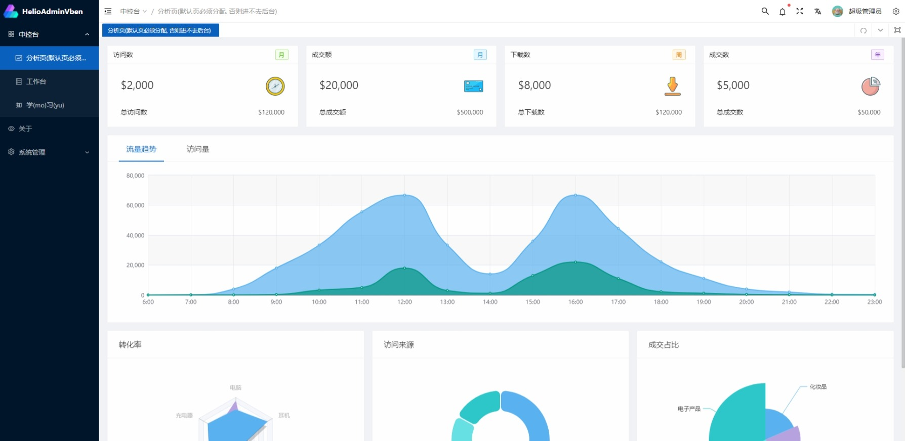
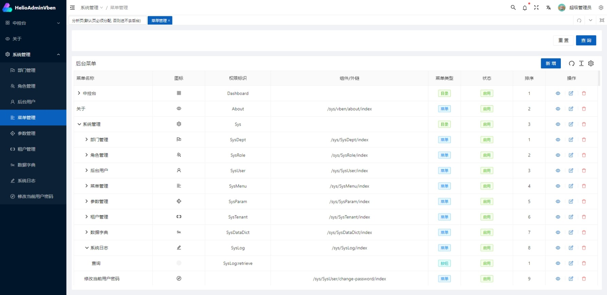
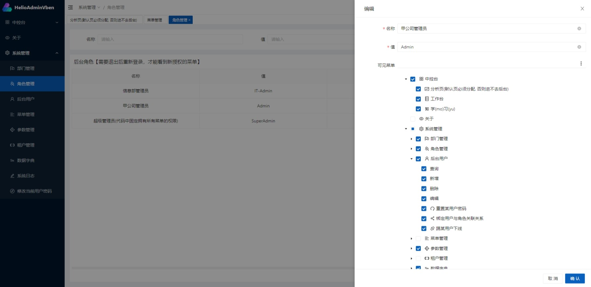

# helio-admin-vue-vben

## 项目说明
基于[Vue Vben Admin](https://github.com/anncwb/vue-vben-admin/) 改造适配的后台管理前端模板，开箱即用

自 `1.6.0` 版本起，可跟随源项目 `main` 分支更新

[源项目官方文档](https://doc.vvbin.cn/)
[相较于源项目的变更](CHANGELOG_HELIO.md)


## 如何使用

1. 从 GitHub 或 Gitee 克隆项目源码，到自己的电脑上
2. 自行安装 `Node.js`18.12.0 或以上版本（建议通过 [nvm](https://www.runoob.com/w3cnote/nvm-manager-node-versions.html) 进行）
    > 对应 nvm 安装命令：`nvm install 18.12.0 && nvm use 18.12.0`
    > 笔者版本：node@18.16.0 pnpm@8.15.3
3. 找到根目录下的`.env.development`，根据后端程序的类型（单体版or微服务版），修改:
    - `VITE_GLOB_API_URL`（全局API_BASE_URL）
    - `VITE_GLOB_UPLOAD_URL`（全局通用文件上传接口）
    - `VITE_GLOB_API_URL_PREFIX`（全局API路由前缀）
4. 在根目录依次执行命令行命令：
    ```
    npm install -g pnpm
    pnpm install
    npm run dev
    ```
5. 浏览器访问http://127.0.0.1:5173 ，就能看到后台管理页面了，默认账户密码`admin admin`


## License
[MIT](./LICENSE)


## 演示效果图



